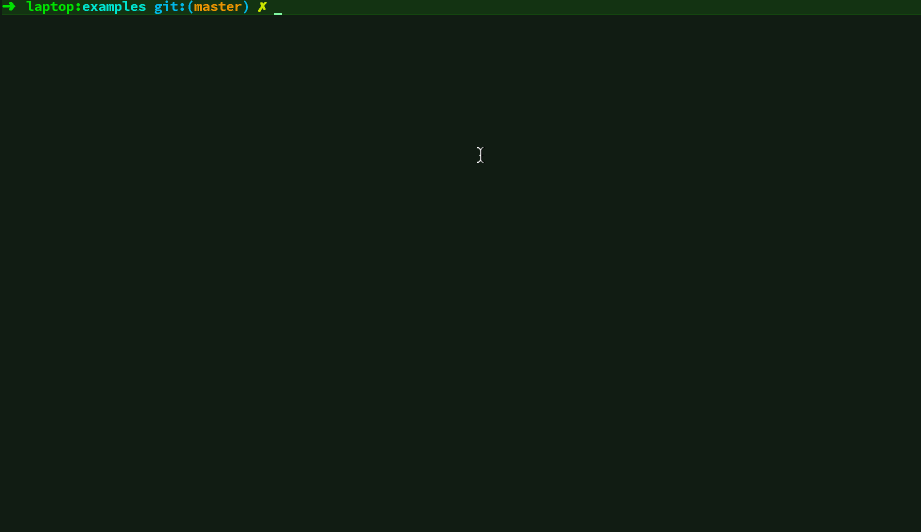

# drawille-chalk 

> drawing in terminal with [unicode braille][] characters _and color_. The idea is based on [drawille](https://github.com/asciimoo/drawille) by @asciimoo.

[](https://www.npmjs.com/package/drawille-chalk)
[]()
[]()




#### updates
*Aril 20 2019* upgrade dependencies to remove deprecation warnings <code>1.1.1 -> 1.1.2</code>

## install

install the [package](https://npmjs.com/drawille-chalk) with `npm` or `yarn`:

```
$ npm install --save drawille-chalk
```
or
```
$ yarn add drawille-chalk
```

## usage

See [examples](examples).

this module provides a very basic API only, for fancy things, like drawing lines, use another module, like [`bresenham`](https://github.com/madbence/node-bresenham).

[`node-drawille`](https://github.com/madbence/node-drawille) original project
forked from.

## api

### `Canvas(w, h)`

Create a new canvas with the given dimensions.
`w` must be multiple of 2, `h` must be multiple of 4.

### `canvas.set(x, y)`

Draw point on `canvas` at the given position.

### `canvas.unset(x, y)`

Delete point on `canvas` at the given position.

### `canvas.toggle(x, y)`

Toggle point on `canvas` at the given position.

### `canvas.clear()`

Clear the whole canvas (delete every point).

### `canvas.frame([delimiter])`

return the current content of `canvas`, as a `delimiter`-delimited
string. `delimiter` defaults to `\n`.

it uses braille characters to represent points,
so every line has length of `w/2`, and the string contains `h/4`
lines.

### `canvas.style(canvas.chalk.*)`

Adds a formatting function to apply to set points upon rendering.

### `canvas.styleEnd()`

Clear current formatting.

## license

MIT

  [unicode braille]: http://en.wikipedia.org/wiki/Braille_Patterns#Chart
